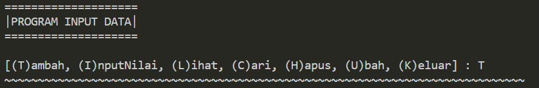
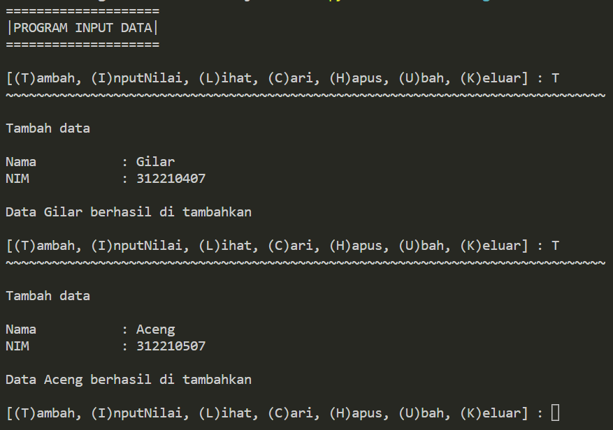
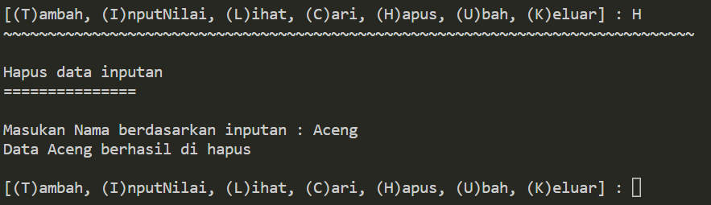
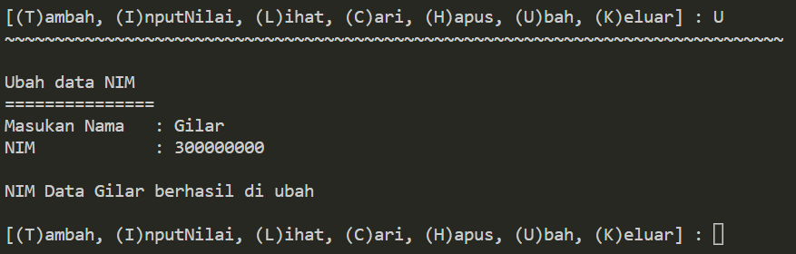
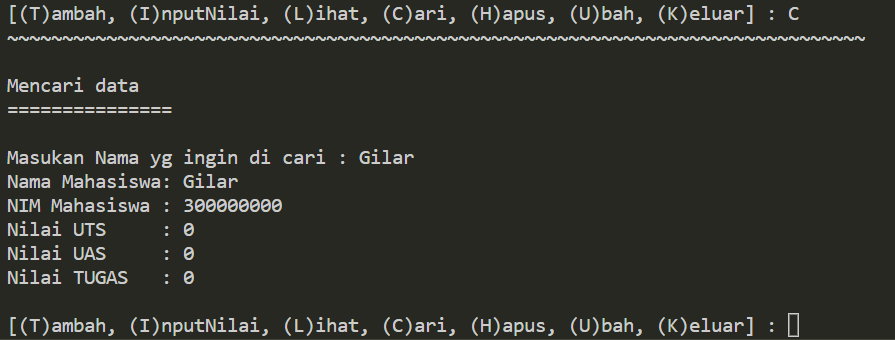
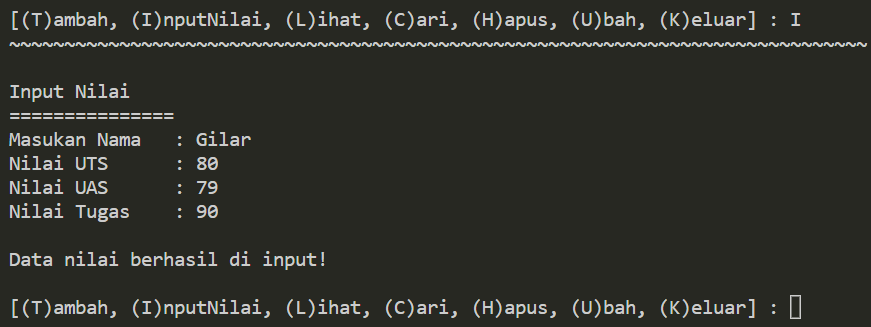

# Project-UAS

## Profil
| Variable | Isi |
| -------- | --- |
| **Nama** | Gilar Sumilar |
| **NIM** | 312210407 |
| **Kelas** | TI.22.A.4 |
| **Mata Kuliah** | Bahasa Pemrograman |
| **Link vidio Penjelasan** | https://www.youtube.com/watch?v=8MzmLtOLDOk |
| **Link Download PDF** | https://drive.google.com/file/d/1QJroGIO46l6eO6xxMBtiEoEDg7dTNLRL/view?usp=sharing |

# UAS

#### Buatlah package dan modul dengan struktur seperti berikut:
- daftar_nilai.py berisi modul untuk:
tambah_data, ubah_data, hapus_data,
dan cari_data
- view_nilai.py berisi modul untuk:
cetak_daftar_nilai, cetak_hasil_pencarian
- input_nilai.py berisi modul untuk:
input_data yang meminta pengguna
memasukkan data.
- main.py berisi program utama (menu
pilihan yang memanggil semua menu
yang ada)

### 1. `main.py` Berisi program utama dengan menu `menu = input("[(T)ambah, (I)nputNilai, (L)ihat, (C)ari, (H)apus, (U)bah, (K)eluar] : ")`

``` Python
from view import input_nilai, view_nilai
from model import daftar_nilai

data = daftar_nilai.Data_mahasiswa()

print("="*20)
print("|PROGRAM INPUT DATA|")
print("="*20)

while True: 
    print()
    menu = input("[(T)ambah, (I)nputNilai, (L)ihat, (C)ari, (H)apus, (U)bah, (K)eluar] : ")
    print("~"*78)
    print()

    if menu.lower() == 't':
        data.tambah()


    elif menu.lower() == "i":
        input_nilai.nilai()


    elif menu.lower() == 'l':
        if data.nama:
            view_nilai.lihat()
        else:
            print("BELUM ADA DATA!, pilih [T/t] untuk menambah data")  

    elif menu.lower() == 'c':
        if data.nama:
            data.cari()
        else:
            print("BELUM ADA DATA!, pilih [T/t] untuk menambah data") 
            

    elif menu.lower() == "h":
        data.hapus(data.nama)


    elif menu.lower() == "u":
        data.ubah(data.nama) 

    elif menu.lower() == "k":
        print("Program selesai, Terima Kasih :) ")
        break

    else:
        print("\n INPUT {} TIDAK ADA!, Silakan pilih [T/L/I/H/U/K] untuk menjalankan program!".format(menu))
```
### Penjelasan 
Di program utama ini terdapat modul yg di import ke file `from view import input_nilai, view_nilai` &
`from model import daftar_nilai`. Modul memungkinkan Anda menulis kode yang terdiri dari beberapa file dan membaginya menjadi bagian-bagian yang lebih kecil, yang dapat diimport sesuai kebutuhan.

#### Contoh tampilan menu :


### 2. `daftar_nilai.py`
Di dalam file daftar nilai ini terdapat sourcecode `input("[(T)ambah, (C)ari, (H)apus, (U)bah] ")`

``` Python
class Data_mahasiswa:
    nama = []
    nim = []
    uts = []
    uas = []
    tugas = []

    # Tambah data
    def tambah(self):
        print("Tambah data\n")
        nama    = input("Nama           : ")
        self.nama.append(nama)
        nim     = int(input("NIM            : "))
        self.nim.append(nim)
        uts     = 0
        self.uts.append(uts)
        uas     = 0
        self.uas.append(uas)
        tugas   = 0
        self.tugas.append(tugas)

        print("\nData {0} berhasil di tambahkan".format(nama))
                
    # Menghapus inputan nama
    def hapus(self, nama):
        print("Hapus data inputan")
        print("="*15)
        nama = (input("\nMasukan Nama berdasarkan inputan : "))
        if nama in self.nama:
            print("Data {0} berhasil di hapus".format(nama))
            index = self.nama.index(nama)
            del self.nama[index]
            del self.nim[index]
            del self.uts[index]
            del self.uas[index]
            del self.tugas[index]
        else:
            print("NAMA {0} TIDAK ADA!".format(nama))
    
        # Mengubah data NIM
    def ubah(self, nama):
        print("Ubah data NIM")
        print("="*15)
        input_nama = input("Masukan Nama : ")
        if input_nama in nama:
            index = nama.index(input_nama)
            self.nim[index]     = int(input("NIM            : "))

            print("\nNIM Data {0} berhasil di ubah".format(input_nama))
        else:
            print("NAMA {0} TIDAK ADA! / ANDA BELUM MENAMBAHKAN DATA".format(input_nama))
            
        # Mencari data yg sudah di input 
    def cari(self):
        print("Mencari data")
        print("="*15)
        nama = (input("\nMasukan Nama yg ingin di cari : "))
        if nama in self.nama:
            index = self.nama.index(nama)
            print(f"Nama Mahasiswa: {self.nama[index]}")
            print(f"NIM Mahasiswa : {self.nim[index]}")
            print(f"Nilai UTS     : {self.uts[index]}")
            print(f"Nilai UAS     : {self.uas[index]}")
            print(f"Nilai TUGAS   : {self.tugas[index]}")
        else:
            print("NAMA {0} TIDAK ADA!".format(nama))
```

### Penjelasan 
Pada bagian dari `daftar_nilai.py` berisi program dengan perintah menambahkan data, hapus data, ubah data NIM,
dan mencari salah satu data yg sudah di input.

#### Tampilan output tambah data :

#### Tampilan output hapus data :
 
#### Tampilan output ubah NIM :

#### Tampilan output cari data :



### 3. `view_nilai.py` berisi sourcode yg berfungsi menampilkan seluruh data

``` Python
from model import daftar_nilai

data = daftar_nilai.Data_mahasiswa()

# Menampilkan seluruh data 
def lihat():
    for i in range(len(data.nama)):
        print(f"\nData ke -{i+1}")
        print(f"Nama Mahasiswa: {data.nama[i]}")
        print(f"NIM Mahasiswa : {data.nim[i]}")
        print(f"Nilai UTS     : {data.uts[i]}")
        print(f"Nilai UAS     : {data.uas[i]}")
        print(f"Nilai TUGAS   : {data.tugas[i]}")
```
### Penjelasan 
Di program ini terdapat modul yg menyambungkan `view_nilai.py` kedalam file program `daftar_nilai.py` 
dengan syntax `from model import daftar_nilai`. Fungsi ny mirip seperti `input = "[(C)ari]"`, tapi fitur ini menampilkan
seluruh data yg sudah di input.

### 4. `input_nilai.py` berisi code yg berfungsi untuk menginput data yaitu nilai

``` Python
from model import daftar_nilai

data = daftar_nilai.Data_mahasiswa()

def nilai():
        print("Input Nilai")
        print("="*15)
        input_nama = input("Masukan Nama   : ")
        if input_nama in data.nama:
            index = data.nama.index(input_nama)
            data.uts[index]     = int(input("Nilai UTS      : "))
            data.uas[index]     = int(input("Nilai UAS      : "))
            data.tugas[index]   = int(input("Nilai Tugas    : "))

            print("\nData nilai berhasil di input!")
        else:
            print("NAMA {0} TIDAK ADA! / ANDA BELUM MENAMBAH DATA".format(input_nama))
```
### Penjelasan 
Di program ini terdapat modul yg menyambungkann `input_nilai.py` kedalam file program `daftar_nilai.py` 
dengan syntax `from model import daftar_nilai`. Fitur ini khusus untuk menginput nilai

#### Tampilan output `input_nilai.py` :

